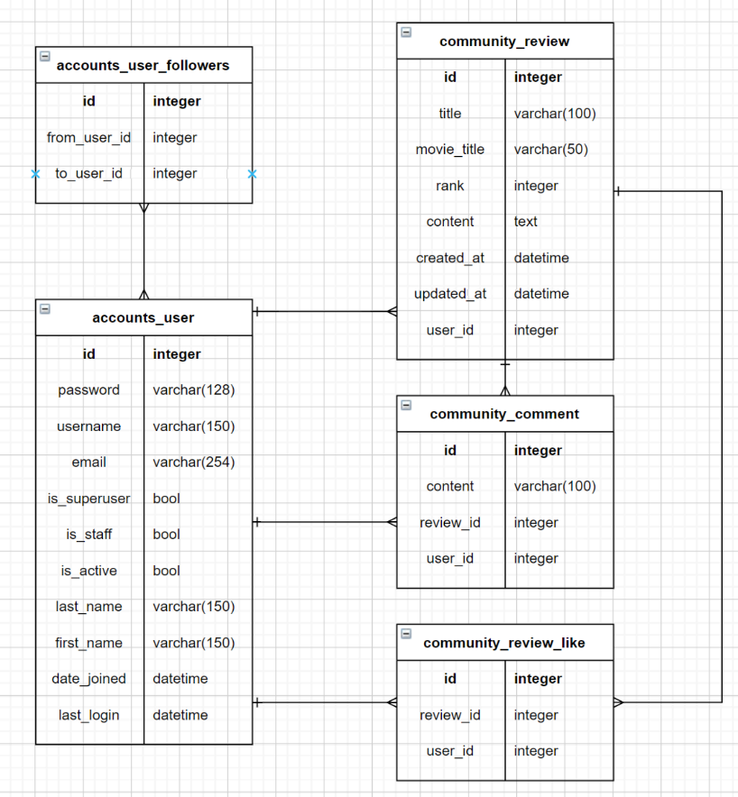
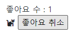

# pjt07 211022


### A. 프로젝트 구조

##### navi : 송상빈 driver : 윤성빈


gitlap에 프로젝트 레파지토리를 생성하고 장고 프로젝트와, 앱을 생성했다.

각 필요한 파일과 템플릿들도 생성했다.


### B. Model

##### navi : 윤성빈 driver : 송상빈



```python
# accounts/models.py
class User(AbstractUser):
    # 한 유저가 여러 유저의 팔로워일수도, 한 유저가 여러 유저를 팔로잉할 수도 있다.
    fans = models.ManyToManyField('self', symmetrical=False, related_name='stars')
    # AbstractUser를 참조하여 사용함
   
#community/models.py
class Review(models.Model):
    title = models.CharField(max_length=100)
    movie_title = models.CharField(max_length=50)
    rank = models.IntegerField()
    content = models.TextField()
    created_at = models.DateTimeField(auto_now_add=True)
    updated_at = models.DateTimeField(auto_now=True)
    
    # 게시글마다 하나의 유저를 참조함.
    user = models.ForeignKey(settings.AUTH_USER_MODEL, on_delete=models.CASCADE)
    
    # 한 게시글에 여러 user가 좋아요를 누를수도, 한 유저가 여러 게시글에 좋아요를 누를수도 있다.
    like_users = models.ManyToManyField(settings.AUTH_USER_MODEL, related_name='like_review')

    
    def __str__(self):
        return self.title


class Comment(models.Model):
    content = models.CharField(max_length=100)
    # 댓글마다 하나의 게시글을 참조함.
    review = models.ForeignKey(Review, on_delete=models.CASCADE)
    # 댓글마다 하나의 유저를 참조함.
    user = models.ForeignKey(settings.AUTH_USER_MODEL, on_delete=models.CASCADE)

    def __str__(self):
        return self.content
```

* ManyToManyField를 사용할 때 related_name을 거꾸로 작성하여 결과가 반대로 나타나기도 했다.

  계속 원하는 결과가 나올 수 있도록 코드를 수정하면서 어떤 이름이 어떤 모델을 참조하는지 확실히 인지할 수 있었다.


### C. Form

##### navi : 윤성빈 driver : 송상빈

```python
#accounts/forms.py

# 기존의 회원가입 폼은 Abstratuser를 상속받아 새로 만들어진 유저 모델엔 사용할 수 없으므로
# 기존의 회원가입 폼을 상속받아 해당 프로젝트에서 사용하는 유저 모델에 적용할 수 있도록 한다.
class CustomUserCreationForm(UserCreationForm):
    
    class Meta(UserCreationForm.Meta):
        model = get_user_model()
        fields = UserCreationForm.Meta.fields + ('email',)
        
#community/forms.py
class ReviewForm(forms.ModelForm):
    
    class Meta:
        model = Review
        # fields = '__all__'
        # 폼 사용시 제외시킬 요소들 지정
        exclude = ('user', 'like_users',)

class CommentForm(forms.ModelForm):
    
    class Meta:
        model = Comment
        exclude = ('review', 'user',)
```

* form에서도 마찬가지로 새로운 객체 생성시 ManyToManyField 요소가 노출되지 않게 하려다가 엉뚱하게 related_name을 제외시켜버리는 등 여러 실수가 있었지만 오늘 확실히 확인할 수 있었다.


### D. URL

##### navi : 송상빈 driver : 윤성빈

```python
# accounts/urls.py

from django.urls import path
from . import views

app_name = 'accounts'
urlpatterns = [
    path('login/', views.login, name='login'),
    path('logout/', views.logout, name='logout'),
    path('signup/', views.signup, name='signup'),
    path('<username>/', views.profile, name='profile'),
    path('<username>/follow/', views.follow, name='follow'),
]

# community/urls.py

from django.urls import path
from . import views

app_name = 'community'
urlpatterns = [
    path('', views.index, name='index'),
    path('create/', views.create, name='create'),
    path('<int:pk>/', views.detail, name='detail'),
    path('<int:pk>/comments/', views.comments_create, name='comments_create'),
    path('<int:review_pk>/likes/', views.likes, name='likes'),
]
```


### E. View & Template

#### E-1. View

##### navi : 윤성빈 driver : 송상빈

```python
# accounts/views.py

# signup, login, logout view함수는 기존에 여러 번 작성해봤기에 큰 어려움 없이 작성할 수 있었다.

def profile(request, username):
    person = get_object_or_404(get_user_model(), username=username)
    context = {
        'person': person,
    }
    return render(request, 'accounts/profile.html', context)

@require_POST
def follow(request, username):
    if request.user.is_authenticated:
        me = request.user
        you = get_object_or_404(User, username=username)
        if me != you:
            if you.fans.filter(pk=me.pk).exists():
                you.fans.remove(me)
            else:
                you.fans.add(me)
        return redirect('accounts:profile', you.username)
    return redirect('accounts:login')
```

* 항상 pk만을 사용하다가 username을 이용해서 특정 user의 데이터를 불러오려고 하니, 자꾸 username를 써야 할 자리에 pk를 쓰는 등 헷갈렸으나, 이후 디버깅을 통해 원하는대로 작동하는 코드를 완성할 수 있었다.


#### E-2. Template

##### navi : 송상빈 driver : 윤성빈

1. Template

base.html 과 accounts 에서 login.html, profile.html, signup.html 을 만들고, community에서 create.html, detail.html, index.html 을 만들었다.

```html
# base.html

<nav class="nav">
      <a class="nav-link active" aria-current="page" href="">INDEX</a>
      
        <a class="nav-link" href="">Create</a>

        <form action="" method="POST">
          
          <input type="submit" value="Logout">
        </form>
      
        <a class="nav-link" href="">Profile</a>
      
        <a class="nav-link" href="">Login</a>
        <a class="nav-link" href="">Signup</a>
      
    </nav>
```

네비게이션을 만들었는데 로그아웃 기능만 작동을 하지 않았다. 그래서 임시방편으로 전에 써놨던 input 태그로 가져왔는데 동작은 제대로 됐지만 미관상 로그아웃부분만 버튼모양이 되었다. -> 주말에 수정해봐야겠다.

follow 기능도 following 과 follower 가 헷갈려서 stars 와 fans 로 수정해서 진행했다.

accounts/views.py 에서 follow 부분이 pk가 아닌 username 으로 받아야해서 조금 헤멨으나 페어와 힘을 합쳐 해결했다. pk 부분을 일일이 name으로 수정했다.

```python
# accounts/views.py

@require_POST
def follow(request, username):
    if request.user.is_authenticated:
        me = request.user
        you = get_object_or_404(User, username=username)
        if me != you:
            if you.fans.filter(pk=me.pk).exists():
                you.fans.remove(me)
            else:
                you.fans.add(me)
        return redirect('accounts:profile', you.username)
    return redirect('accounts:login')
```

2. 리뷰 좋아요 기능

```html



  <h2>DETAIL</h2>
  <h3>{{ review.pk }} 번째 리뷰</h3>
  <hr>
  <p>리뷰 제목 : {{ review.title }}</p>
  <p>영화 제목 : {{ review.movie_title }}</p>
  <p>평점 : {{ review.rank }}</p>
  <p>리뷰 내용 : {{ review.content }}</p>
  <p>작성시각 : {{ review.created_at }}</p>
  <p>수정시각 : {{ review.updated_at }}</p>
  <hr>

  <a href="">[back]</a>
  <hr>
  <h4>댓글 목록</h4>
  
    <p><b>{{ comments|length }}개의 댓글이 있습니다.</b></p>
  
  <ul>
    
      <li>
        {{ comment.user }} - {{ comment.content }}
      </li>
    
      <p>댓글이 없어요..</p>
    
  </ul>
  <div>
    <form action="" method="POST">
      
      <div>좋아요 수 : {{ review.like_users.all|length }}</div>
      
        <i class="fas fa-cat"></i>
        <input type="submit" value="좋아요 취소">
      
        <span style="color:white"><i class="fas fa-cat"></i></span>
        <input type="submit" value="좋아요">
      
    </form>
  </div>
  <hr>
  
    <form action="" method="POST">
      
      {{ comment_form }}
      <input type="submit">
    </form>
  
    <a href="">[댓글을 작성하려면 로그인하세요.]</a>
  

```

좋아요 버튼을 누르면 귀여운 고양이 아이콘이 뜨고, 좋아요를 취소하면 고양이 아이콘이 사라지게 만들었다. 


