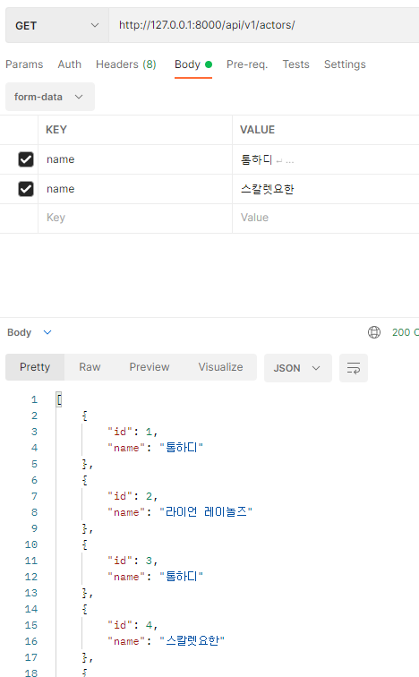
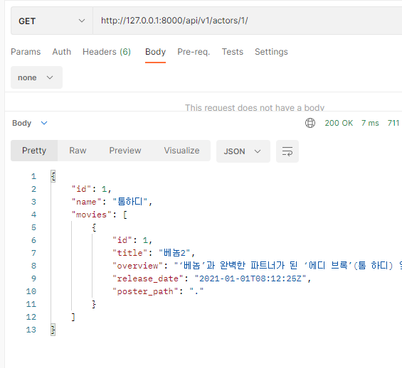
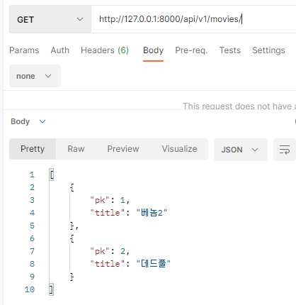

# README

# README_seongbin

A. 프로젝트 구조 

driver: 윤성빈 navi: 이주용

페어 프로젝트를 하면서 계속 A 단계를 맡아서 했었는데 오늘은 깃이그노어 파일을 만들기도 전에 

가상환경을 만들어서 페어와 push, pull 하는 과정에서 계속 가상환경 오류가 생겼었다.

매번 가상환경을 지우고 다시 설치하는 번거로움이 있었다. 다시한번 프로젝트 초기셋팅 단계를 

단계화해서 공부해야겠다고 느꼈다.

B. Model, C. URL

driver: 이주용 navi: 윤성빈


django 마지막 프로젝트를 진행했습니다. 항상 그랬듯이 먼저 초반 환경설정 작업을 진행했습니다.

그 다음 성빈님과 서로의 역할을 정하여 순차적으로 진행했습니다. Navigator와 Driver의 역할을 순서대로 진행하며 서로가 모르는 부분을 알려주며 진행하였습니다. 중간에 오류가 난다면 다시 한번 검토하여 중간중간 체크하였습니다. 각자 맡은 역할을 수행하고 push pull 하는 작업을 통해 좀 더 빠른 협업을 할 수 있었습니다. 

오늘도 Movie를 주제로 프로젝트를 진행했습니다. 이전과 다르게 난이도가 급상승 한 것 같아서 매우 어려웠습니다. 새로운 코드들을 프로젝트에 적용하려다 보니 어느 부분에 어느 상황에 넣어야 하는지 헷갈렸습니다. 하지만 성빈님과 함께 modeling부터 시작해서 차근차근 시작했습니다. 그 이후 서로 역할을 바꿔가며 코드를 작성했고 계속해서 오류가 있는 부분을 체크했습니다. top_review url부분에서 typeError가 발생했는데 어떤 원인으로 이 오류가 발생했는지 알아내지 못했습니다. 이 부분에 대해서는 좀 더 공부를 하고 보완하도록 하겠습니다. 오류가 난 부분 외에도 좀 더 공부를 해서 django를 능숙하게 사용할 수 있도록 노력하겠습니다.


D. Admin

driver: 윤성빈 navi: 이주용


E . Serializer & View

driver: 윤성빈 navi: 이주용

1.  Actor

```python
class ActorListSerializer(serializers.ModelSerializer):
    class Meta:
        model = Actor
        fields = ('id', 'name',)

class ActorSerializer(serializers.ModelSerializer):

    class MovieSerializer(serializers.ModelSerializer):
        class Meta:
            model = Movie
            fields = ('id', 'title','overview','release_date','poster_path')
        
    name = serializers.CharField(min_length=1, max_length=100)
    movies = MovieSerializer(many=True, read_only=True)

    class Meta:
        model = Actor
        fields = ('id', 'name', 'movies')
```


2.  Movie

```python
class MovieListSerializer(serializers.ModelSerializer):
    
    class Meta:
        model = Movie
        fields = ('pk', 'title',)

class MovieSerializer(serializers.ModelSerializer):

    class ActorSerializer(serializers.ModelSerializer):
        class Meta:
            model = Actor
            fields = ('pk', 'name',)

    class ReviewSerializer(serializers.ModelSerializer):
        class Meta:
            model = Review
            fields = ('pk', 'title',)

    title = serializers.CharField(min_length=2, max_length=100)
    actors = ActorSerializer(many=True, read_only=True)
    reviews = ReviewSerializer(many=True, read_only=True)

    actor_pks = serializers.ListField(write_only=True)

    class Meta:
        model = Movie
        fields = ('id', 'title', 'actors', 'reviews', 'actor_pks')
```


3. Review

```python
class TopReviewListSerializer(serializers.ModelSerializer):

    class MovieSerializer(serializers.ModelSerializer):
        class Meta:
            model = Review
            fields = ('pk', 'title',)

    movie = MovieSerializer(many=True)

    class Meta:
        model = Review
        fields = ('pk', 'title', 'movie')

class ReviewSerializer(serializers.ModelSerializer):

    class MovieSerializer(serializers.ModelSerializer):
        class Meta:
            model = Movie
            fields = '__all__'

    content = serializers.CharField(required=False)
    movie = MovieSerializer(many=True, read_only=True)

    class Meta:
        model = Review
        fields = ('pk', 'title', 'movie', 'content')

    def create(self, validated_data):
        actor_pks = validated_data.pop('actor_pks')
        review = Review.objects.create(**validated_data)
        for actor_pk in actor_pks:
            review.actors.add(actor_pk)
        return review

    def update(self, review, validated_data):
        actor_pks = validated_data.pop('actor_pks')
        for attr, value in validated_data.items():
            setattr(review, attr, value)
        review.save()

        review.artists.clear()
        for actor_pk in actor_pks:
            review.artists.add(actor_pk)
        return review
```

오전에 유튜브 강의를 보지않았다면 절대 코드를 작성하지 못했을 것 같다. 지금까지 했던 페어프로젝트 중에서 가장 난이도가 높았다. 각 모델 별로 db가 어떻게 연결되어있는지, 그걸 어떻게 나타낼건지 페어와 함께 생각해보면서 겨우겨우 코드를 작성해나갔다. 시간은 오래 걸렸지만 다 작성하고 동작하는 서버를 보니 뿌듯했다.

전체적으로 코드를 다 짜고 서버를 실행시켜보니 다른 url들은 접속이 잘 되는데 top_review 접속에서 타입에러가 발생했다. 어느 부분에서 정확히 에러가 났는지 장고가 알려주지않아서 에러를 30분간 페어와 같이 찾다가 포기했다. 


F. API test

driver: 윤성빈 navi: 이주용








