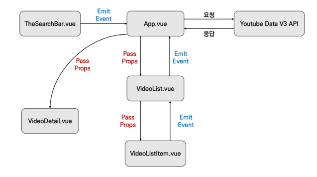

# my first youtube project



### 1. 프로젝트 준비

#### 프로젝트 생성 및 lodash 설치

```python
$ vue create vue_04_workshop
$ cd vue_04_workshop
$ npm i lodash
```

### 유튜브 검색 데이터 (TheSearchBar.vue)

#### 컴포넌트 등록

```vue
// App.vue

<template>
  <div id="app">
    <h1>My first youtube project</h1>
    <!-- 3. 사용하기 -->
    <the-search-bar></the-search-bar> 
  </div>
</template>

<script>
// 1. 가져오기
import TheSearchBar from './components/TheSearchBar.vue' 

export default {
  name: 'App',
  components: {
    TheSearchBar, // 2. 등록하기
  },
  ...
}
</script>
```

#### Emit Event (TheSearchBar.vue -> App.vue)

* 검색한 검색어를 searchbar에서 입력 받아서 app.vue로 emit event 해준다

```vue
// TheSearchBar.vue

<template>
  <div>
      <!-- 이벤트등록 엔터키가 눌릴때마다 onInputKeyword method 실행 -->
    <input type="text" @keyup.enter="onInputKeyword">
  </div>
</template>

<script>
export default {
  name: 'TheSearchBar',
  methods: {
    // 발생된 event를 받는다. event.target.value를 가지고 input-change 이름으로 emit 한다.
    onInputKeyword: function (event) {
      this.$emit('input-change', event.target.value)
    }
  }
}
</script>
```

#### 이벤트 청취 후 함께 전달 된 데이터 할당

```vue
<template>
  <div id="app">
    <h1>My first youtube project</h1>
    <!-- input-change 이벤트를 청취하면 onInputChange 메서드 함수 실행 -->
    <the-search-bar @input-change="onInputChange"></the-search-bar>
  </div>
</template>

<script>
import TheSearchBar from './components/TheSearchBar.vue'

export default {
  ...
  data: function () {
    return {
      // 검색어 입력 받을 변수
      inputValue: null,
    }
  },
  methods: {
    // 전달 된 데이터를 매개변수로 inputValue 데이터에 입력한다.
    onInputChange: function (inputText) {
      this.inputValue = inputText
    }
  }
}
</script>
```

### 유튜브 요청 & 응답 데이터 처리 (App.vue)

#### API_KEY, API_URL 할당

#### Youtube API 요청 & 응답 데이터를 변수에 할당

```python
$ npm install axios
# Axios는 브라우저, Node.js를 위한 Promise API를 활용하는 HTTP 비동기 통신 라이브러리입니다
```

```vue
// App.vue

<script>
import axios from 'axios'
import TheSearchBar from './components/TheSearchBar.vue'
    
const API_KEY = process.env.VUE_APP_YOUTUBE_API_KEY
const API_URL = 'https://www.googleapis.com/youtube/v3/search'

export default {
  ...
  data: function () {
    return {
      inputValue: null,
      videos: [],
    }
  },
  methods: {
    onInputChange: function (inputText) {
      this.inputValue = inputText
      
      const params = {
        key: API_KEY,
        part: 'snippet',
        type: 'video',
        q: this.inputValue,
      }
      axios({
        method: 'get',
        url: API_URL,
        params,
      })
        // 응답 성공
        .then(res => {
          console.log(res)
          this.videos = res.data.items
        })
        // 응답 실패
        .catch(err => {
          console.log(err)
        })
    }
  }
}
</script>
```

#### Pass props (App.vue -> VideoList.vue)

* 할당 한 응답 데이터를 하위 컴포넌트로 전달

```vue
// App.vue

<template>
  <div id="app">
    <h1>My first youtube project</h1>
    <header>
      <the-search-bar @input-change="onInputChange"></the-search-bar>
    </header>
    <section>
      <!-- 입력받은 데이터 videos를 v-bind로 videos라는 이름으로 묶음 -->
      <video-list :videos="videos"></video-list>
    </section>
  </div>
</template>
```

#### 내려받은 prop 데이터 선언 후 사용

```vue
// VideoList.vue

<template>
  <ul>
    <li v-for="video in videos" :key="video.id.videoId">
      {{ video.snippet.title }}
    </li>
  </ul>
</template>

<script>
export default {
  name: 'VideoList',
  // 내려받은 데이터 선언, 전달받은 videos 데이터는 array 타입이다.
  props: {
    videos: {
      type: Array,
      required: true,
    }
  }
}
</script>
```

#### Pass props (VideoList.vue -> VideoListItem.vue)

```vue
// VideoList.vue

<template>
  <ul>
    <!-- 3. 사용하기 -->
    <video-list-item
      v-for="video in videos"
      :key="video.id.videoId"
      :video="video"
    > <!-- v-for로 하나씩 받은 video를 바인드로 묶는다. -->
    </video-list-item>
  </ul>
</template>

<script>
// 1. 가져오기
import VideoListItem from './VideoListItem'

export default {
  name: 'VideoList',
  components: {
    // 2. 등록하기
    VideoListItem,
  },
  props: {
    ...
  }
}
</script>
```

#### 내려받은 prop 데이터(개별 video 객체) 선언 후 사용

```vue
// VideoListItem.vue

<template>
  <li>
    
    {{ video.snippet.title }}
  </li>
</template>

<script>
export default {
  name: 'VideoListItem',
  // 내려받은 데이터 선언
  props: {
    video: {
      type: Object,
      required: true,
    }
  }
}
</script>
```

### 유튜브 영상 상세 정보 - VideoDetail.vue

#### 유튜브 상세 영상 정보 알리기 VideoListItem.vue -> VideoList.vue

```vue
// VideoListItem.vue

<template>
  <!-- 내려받은 prop 데이터에서 비디오 객체의 썸네일 이미지를 뽑은것을 클릭 이벤트 발생 -->
  <li @click="selectVideo">
	...
  </li>
</template>

<script>
export default {
  ...
  // 클릭 이벤트가 발생하면 selectVideo 함수가 실행된다
  methods: {
    selectVideo: function () {
      // 이 event를 선택받은 비디오 객체 하나와 select-video 이름으로 emit한다 VideoList.vue로
      this.$emit('select-video', this.video)
    }
  }
}
</script>
```

```vue
// VideoList.vue

<template>
  <ul>
    <video-list-item
      v-for="video in videos"
      :key="video.id.videoId"
      :video="video"
      @select-video="onSelectVideo"
    > <!-- select-video 이벤트를 청취하면 onSelectVideo 메서드 실행 -->
    </video-list-item>
  </ul>
</template>

<script>
...
export default {
  ...
  // 이벤트가 발생될 때 올려받은 video 객체를 매개변수로 고대로 다시 App.vue로 emit한다
  methods: {
    onSelectVideo: function (video) {
      this.$emit('select-video', video)
    }
  }
}
</script>
```

#### 유튜브 상세 영상 정보 알리기 VideoList.vue -> App.vue

```vue
// App.vue

<template>
  <div id="app">
    <h1>My first youtube project</h1>
    <header>
      <the-search-bar @input-change="onInputChange"></the-search-bar>
    </header>
    <section>
      <!-- select-video 이벤트를 청취 -->
      <video-list :videos="videos" @select-video="onVideoSelect"></video-list>
    </section>
  </div>
</template>

<script>
...
export default {
  ...
  data: function () {
    return {
      inputValue: null,
      videos: [],
      selectedVideo: null, // 올려받을 video 객체를 넣을 변수
    }
  },
  methods: {
    ...
    // 올려받은 video를 selectedVideo 데이터에 넣는다
    onVideoSelect: function (video) {
      this.selectedVideo = video
    }
  }
}
</script>
```

#### App 컴포넌트에서 내린 데이터가 VideoDetail에 전달 되었는지 확인

```vue
// App.vue

<template>
  <div id="app">
    <h1>My first youtube project</h1>
    <header>
      <the-search-bar @input-change="onInputChange"></the-search-bar>
    </header>
    <section>
      <!-- 3. 가져오기 -->
      <!-- 내려보낼 selectedVideo를 v-bind로 묶는다 -->
      <video-detail :video="selectedVideo"></video-detail>
      <video-list :videos="videos" @select-video="onVideoSelect"></video-list>
    </section>
  </div>
</template>

<script>
...
import VideoDetail from './components/VideoDetail.vue' // 1. 가져오기

export default {
  ...
  components: {
    TheSearchBar,
    VideoList,
    VideoDetail, // 2. 등록하기
  },
  ...
}
</script>
```

#### 유튜브 상세 영상 정보 알리기 App.vue -> VideoDetail.vue

```python
$ npm install lodash
```

```vue
// VideoDetail.vue

<template>
  <div>
    {{ video }}
  </div>
</template>

<script>
import _ from 'lodash'

export default {
  name: 'VideoDetail',
  // 내려받은 데이터를 선언
  props: {
    video: {
      type: Object,
    }
  },
  computed: {
    ...
    // 이거 안됨 물어보기
    videoTitle: function (video) {
      return _.unescape(video.snippet.title)
    }
  }
}
</script>
```

#### VideoDetail 컴포넌트 마무리

```vue
// VideoDetail.vue

<template>
  <div v-if="video">
    <div>
      <iframe :src="videoURI" frameborder="0"></iframe>
    </div>
    <h2>{{ videoTitle }}</h2>
    <hr>
    <p>{{ video.snippet.description }}</p>
  </div>
</template>

<script>
...
export default {
  ...
  computed: {
    videoURI: function () {
      const videoId = this.video.id.videoId
      return `https://www.youtube.com/embed/${videoId}`
    },
	...
  }
}
</script>
```

### Environment Variable

#### API 키 환경변수 설정

* vue 프로젝트 안에 `.env.local` 파일 생성
* VUE_APP_YOUTUBE_API_KEY=`key 값 넣기`
* App.vue 파일에 `const API_KEY = process.env.VUE_APP_YOUTUBE_API_KEY`


